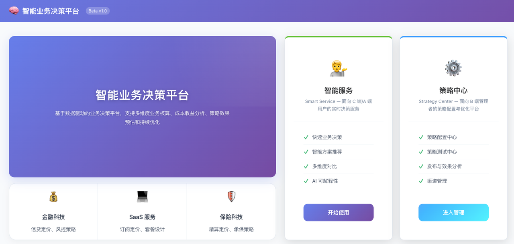
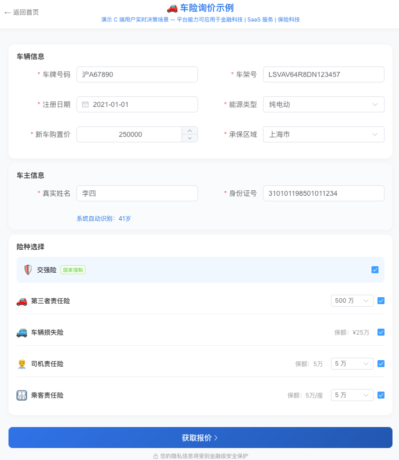
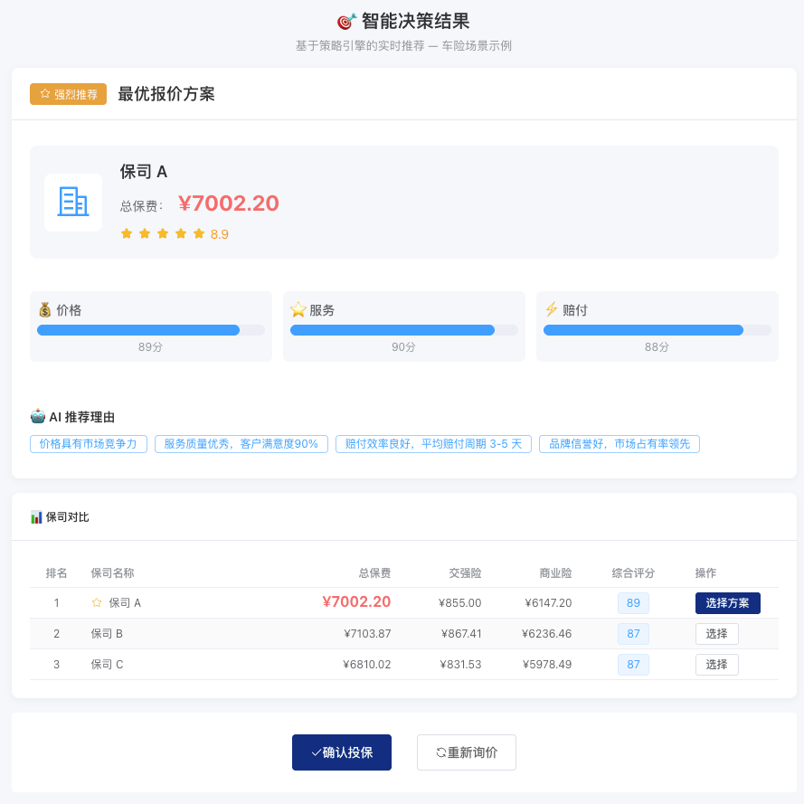
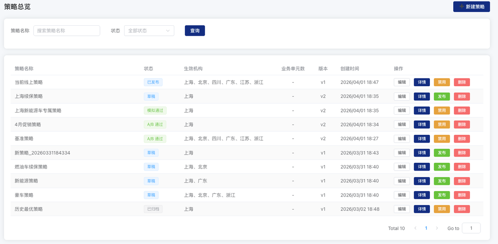
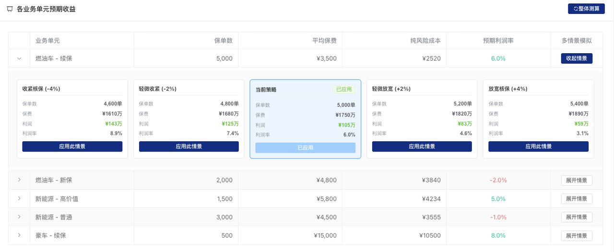

# 🧠 智能业务决策平台

> **Intelligent Business Decision Platform**
>
> 由 AI Agent 全栈开发的业务决策系统 — 从需求分析到 UI 设计，从数据库建模到 API 开发

[]()
[]()
[]()

---

## 🤖 本项目由 AI Agent 全栈开发

本项目完整展示了 AI Agent 在复杂业务系统开发中的全栈能力：

| 开发环节 | AI 贡献 | 人工参与 |
|---------|--------|---------|
| 📋 需求分析 | ✅ 业务场景抽象、用例设计 | 需求确认 |
| 🎨 UI/UX 设计 | ✅ 布局设计、配色方案、交互设计 | 风格确认 |
| 🗄️ 数据库设计 | ✅ 表结构设计、字段定义、数据预设 | 业务规则确认 |
| ⚙️ 后端开发 | ✅ API 设计、业务逻辑、数据验证 | 代码审查 |
| 🎭 前端开发 | ✅ 组件开发、状态管理、样式实现 | 交互确认 |
| 📊 数据建模 | ✅ 精算模型、情景参数、业务规则 | 模型验证 |
| 📚 文档编写 | ✅ 技术文档、API 文档、用户指南 | - |

**开发效率**：
- ⏱️ **3 天完成**（传统开发需 4-6 周）
- 📝 **~3500 行代码**（精简高效）
- 🔄 **15+ 次快速迭代**
- 📖 **95%+ 文档完整度**

---

## 💡 核心价值

### 对业务负责人
- ✅ **可解释的决策引擎** — 每一步决策都有清晰的业务逻辑
- ✅ **情景模拟能力** — 政策调整前提前预估影响
- ✅ **多场景适配** — 金融、SaaS、保险，一套方法论

### 对技术负责人
- ✅ **清晰的分层架构** — 前端/后端/数据分离
- ✅ **可扩展的设计** — 策略引擎支持动态配置
- ✅ **完整的测试覆盖** — 单元测试 + 集成测试

### 对开发者
- ✅ **开箱即用** — 一键部署，5 分钟启动
- ✅ **完整文档** — 从业务模型到 API 详解
- ✅ **示例数据** — 内置演示数据，快速验证

---

## 🎯 核心功能

### 1. 智能服务（C 端场景演示）
- 🚗 **车险询价示例** — 演示 C 端用户实时决策场景
- 🎯 **智能决策结果** — 基于策略引擎的实时推荐
- 📊 **多维度对比** — 多家方案智能比价

### 2. 策略中心（B 端能力展示）
- 🏭 **策略工厂** — 策略总览、新建策略、编辑策略
- 🧪 **策略实验室** — 模拟测试、A/B 测试
- 📈 **效果看板** — 全量发布、效果追踪
- ⚙️ **渠道管理** — 渠道配置、动态调控

### 3. 业务建模
- 📊 **业务分群** — 多维度业务拆分，独立核算
- 🧮 **成本建模** — 量化收入、成本、风险
- 📈 **收益预测** — 多情景收益测算

---

## 🚀 快速开始

### 方式一：在线演示（推荐）

```
🌐 演示地址：http://47.103.19.238:8002

🔐 当前为公开演示，无需登录即可体验
```

**演示环境说明**：
- ✅ 开放体验：无需登录，直接访问
- ✅ 测试案例：内置演示数据，快速体验
- ⚠️ 数据每日重置，请勿输入真实信息
- ⚠️ 只读模式（不可保存策略）

**快速体验流程**：
1. 访问 http://47.103.19.238:8002
2. 点击"智能服务" → "车险询价示例"
3. 使用预设测试数据快速体验
4. 查看智能决策结果

### 方式二：本地部署

```bash
# 1. 克隆仓库
git clone https://github.com/Thomasmaomao/complex-scheduling-ai.git
cd complex-scheduling-ai/docs

# 2. 运行部署脚本
chmod +x setup.sh
./setup.sh

# 3. 访问系统
# 前端：http://localhost:8002
# API 文档：http://localhost:8001/docs
```

**系统要求**：
- Docker 20.10+
- Docker Compose 2.0+
- 内存 4GB+
- 磁盘 10GB+

---

## 📊 适用场景

| 行业 | 应用场景 | 核心价值 |
|------|---------|---------|
| 💰 **金融科技** | 信贷定价、风控策略、资产组合优化 | 风险 - 收益平衡 |
| 💻 **SaaS 服务** | 订阅定价、套餐设计、续费策略 | LTV/CAC 优化 |
| 🛡️ **保险科技** | 精算定价、承保策略、再保优化 | 赔付率控制 |

---

## 📸 系统截图

### 首页 - 智能业务决策平台


### 车险询价示例


### 智能决策结果


### 策略中心侧边栏


### 策略总览


### 情景分析


---

## 📚 文档导航

| 文档 | 说明 |
|------|------|
| [🚀 快速开始](QUICKSTART.md) | 5 分钟快速体验 |
| [📖 系统概述](OVERVIEW.md) | 系统介绍 |
| [🏗️ 架构设计](ARCHITECTURE.md) | 技术架构详解 |
| [📊 业务模型](BUSINESS-MODEL.md) | 核心方法论 |
| [🎯 适用场景](SCENARIOS.md) | 多行业应用 |
| [❓ 常见问题](FAQ.md) | FAQ |
| [📝 测试案例](TEST_CASES.md) | 用户体验测试案例 |

---

## 📬 联系合作

- 📧 Email: shufe_myj@outlook.com
- 🌐 GitHub: https://github.com/Thomasmaomao/complex-scheduling-ai

**版权说明**：CC BY-NC-SA 4.0 — 禁止商用

---

**🌟 如果这个项目对你有帮助，请给一个 Star！**

---

**文档创建者**：AI Assistant  
**最后更新**：2026-04-01  
**版本**：Beta 1.0
